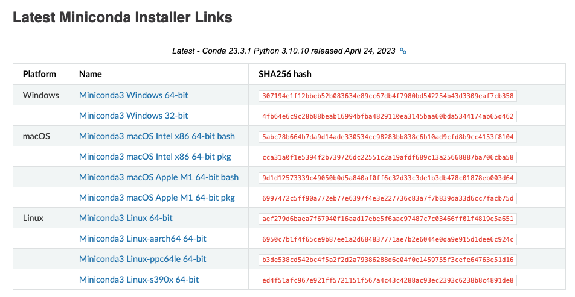

# Table of Contents
1. [Necessary Software](#necssary)
2. [Conda Set Up](#conda)
   - [Conda Basics](#condabasics)
3. [Jupyter Notebook Set Up](#jupyter)
4. [Example Datasets](#data)
5. [Recommended Software](#recommended)
6. [Optional Software](#optional)

# Necessary Software <a name ="necssary"></a>
- Workshop materials will be hosted on the github repo: https://github.com/mattbeckley/PDALIntro  Updates to the workshop will be pushed to this site, so make sure to sync with the latest version before the workshop

- [Miniconda](https://docs.conda.io/en/latest/miniconda.html) is a free, light-weight version of conda.  It will be used to install most essential command line based software.  Details on how to install miniconda are in the [section below](#conda)
- [PDAL](https://pdal.io/en/2.5.3/about.html). The workshop will follow the markdown tutorials using a command line version of PDAL.  Users are expected to have a working version of PDAL so that they can copy and paste commands from the tutorial into their PDAL installation. It is HIGHLY recommended that users use conda to install PDAL.  Details on how to do this are [below](#conda)

- [GDAL](https://gdal.org/download.html#conda). Portions of  the tutorial will utilize GDAL to grid point clouds, look at metadata, perform raster math, etc. It is recommended that users use conda to install GDAL.  Details on how to do this are [below](#conda).

- [git](https://github.com/git-guides/install-git). Cloning of the [git repo for this workshop](https://github.com/mattbeckley/PDALIntro) is recommended so that users have local access to the data, pipelines, and markdown documents for the workshop. **If you are new to to git**, it is recommended to use [git Desktop](https://desktop.github.com/)
    - **NOTE** If it is not possible to install git and clone the repo, users can always download a zip file directly from github repo so that workshop materials are available locally:

    


# Conda Set Up <a name ="conda"></a>
Conda is an open source package management system and environment management system that runs on Windows, macOS and Linux. Conda quickly installs, runs, and updates packages and their dependencies. [Miniconda](https://docs.conda.io/en/latest/miniconda.html) is a free, light-weight version of conda.  It is recommended to use miniconda to install PDAL and other packages for this workshop.  

Download the conda installer for your OS setup. https://docs.conda.io/en/latest/miniconda.html



- **Note if using Mac OSx** it is probably easiest to use the .pkg file.  Also, if using a newer mac with M1 chips make sure to select that version (i.e. Miniconda3 macOS Apple M1 64-bit pkg) and **NOT** the older intel-based option (Miniconda3 macOS Intel x86 64-bit pkg)


After installing conda, create an isolated workspace for this workshop.  
```
conda create --name pdalworkshop
conda activate pdalworkshop
```

Install PDAL, GDAL, jq, and jupyter notebook via conda:

`conda install -c conda-forge pdal jq gdal notebook nb_conda_kernels `

To verify your installation of PDAL and GDAL, issue the following commands and you should see the version numbers printed to the terminal:

```
pdal --version
gdalinfo --version
```

## Conda Basics <a name ="condabasics"></a>
- Below are some basic, commonly used conda commands

- To verify that conda is installed and running on your system:
```
conda --version
```
- To get into a workspace:
```
conda activate pdalworkshop
```
- Similarly, to exit:
```
conda deactivate pdalworkshop
```
- To get a list of the environments created on your system:
```
conda info --envs
```
- To clone an existing environment (in this example, "workspace"):
```
conda create --name workspace_clone --clone workspace
```
- To search for a package to install:
```
conda search lftp
```
- To search for a package on a specific conda channel:
```
conda search -c conda-forge lftp
```
- To install a specific version of software:
```
conda create -n gdal244 -c conda-forge gdal==2.4.4
```

Once installed, Windows users should use the "Anaconda Prompt (miniconda)" to utilize conda in the terminal.

# Jupyter Notebook Set Up <a name ="jupyter"></a>
**Note** For this workshop, use of the notebooks is optional and is designed for use with bash shell. Windows users may be able to run the notebook in a windows terminal session, but this has not been fully tested.

A bash notebook with PDAL commands will be available. Users who wish to use this notebook will need to install the bash_kernel. To enable a bash kernel in a jupyter notebook environment:

`conda activate pdalworkshop`

`pip install bash_kernel ; python -m bash_kernel.install`

- To run the jupyter notebook, run the following command from the notebook location:

`jupyter notebook`


# Example Datasets <a name ="data"></a>
- There are some example [LAZ](https://laszip.org/) files under the data directory of the git repo.  However, users are also encouraged to use their own data, or download data from [OpenTopography](https://portal.opentopography.org/datasets).  **Note** for the workshop, it is best to work with smaller files to keep processing times short.  As a rule of thumb, keeping datasets below 5 million points is recommended for quick processing times.


# Recommended Software <a name ="recommended"></a>

- GIS.  It will be useful to have a GIS (e.g. QGIS, ArcGIS, Global Mapper) to visualize some of the raster outputs.  Users who do not have a GIS can download and install the freely available QGIS software: https://www.qgis.org/en/site/forusers/download.html  **Note that starting in version 3.18, QGIS has native point cloud support.**
- Jupyter notebook. Best installed with conda ([see conda section above](#conda))
- [jq](https://stedolan.github.io/jq/): a useful JSON parser.  Best installed with conda (see command above)

# Optional Software <a name ="optional"></a>
- As time permits, the workshop will highlight a simplified workflow of how to access USGS 3DEP data from AWS for those who are unfamiliar with working with Jupyter Notebooks.  

- Users who are comfortable with Jupyter Notebooks are encouraged to explore OpenTopography notebooks for working with USGS 3DEP data.  There are a series of notebooks here: https://github.com/OpenTopography/OT_3DEP_Workflows/tree/main/notebooks. As an introduction, it is recommended to start with: [01_3DEP_Generate_DEM_User_AOI.ipynb](https://github.com/OpenTopography/OT_3DEP_Workflows/blob/main/notebooks/01_3DEP_Generate_DEM_User_AOI.ipynb) which will explain how to download USGS 3DEP data, and create a DEM. Follow the instructions for "Option 2: Local Installation", specifically:

```
#create new working directory for 3DEP work...
mkdir 3DEP
cd 3DEP
git clone https://github.com/OpenTopography/OT_3DEP_Workflows
cd OT_3DEP_Workflows
conda env create -n 3dep --file environment.yml
```

