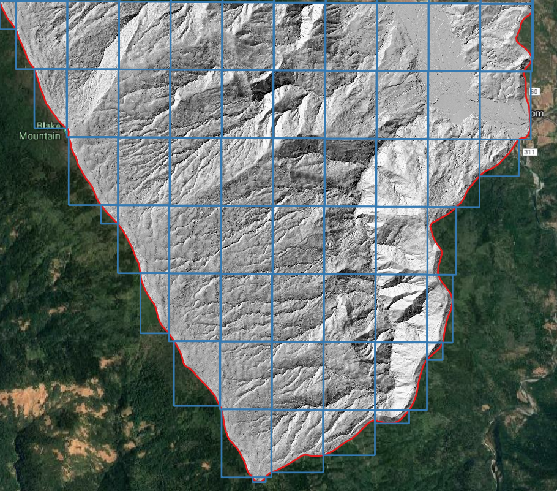
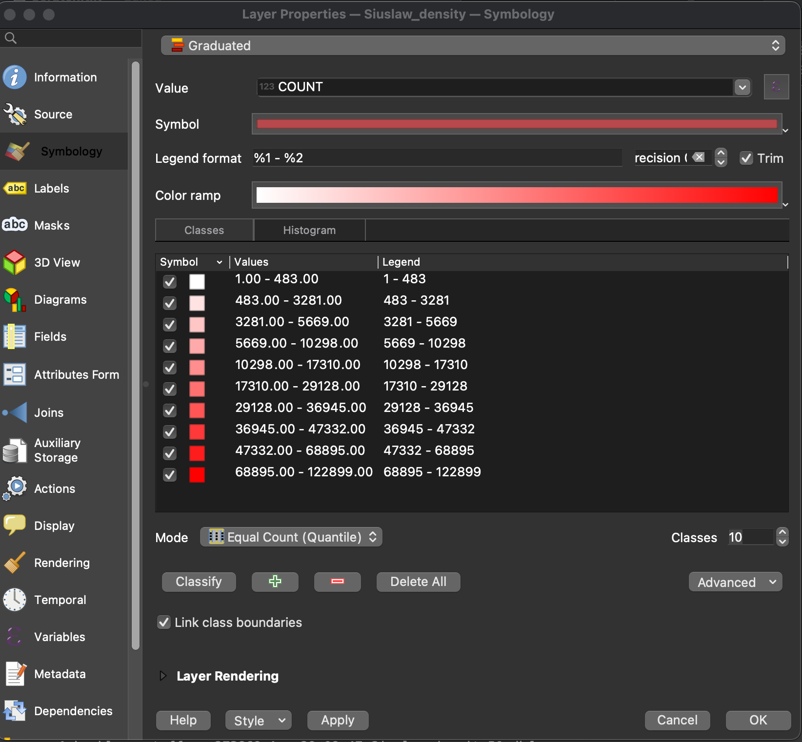
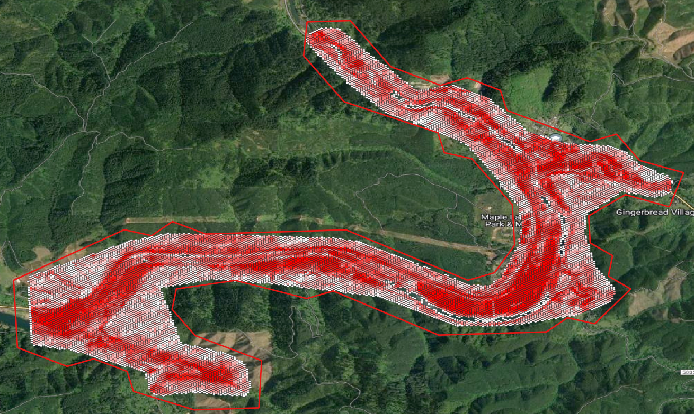

# Table of Contents
1. [File I/O](#fileIO)
2. [Reprojection](#reprojection)
3. [Tiling](#tiling)
4. [Thinning](#thin) 
5. [Creating Boundaries](#boundary)
6. [Exercises](#exercises)

# File I/O <a name ="fileIO"></a>
- PDAL is often utilized to work with lidar files which are typically [LAS](https://www.asprs.org/divisions-committees/lidar-division/laser-las-file-format-exchange-activities#:~:text=The%20LAS%20file%20format%20is,x%2Cy%2Cz%20tuplet.) or LAZ formats.  However, sometimes files are provided as XYZ text or other less common format.  PDAL can read/write in a variety of formats, and is useful for doing basic file I/O operations.


```
{"pipeline": [
    {
     "type":"readers.text",
     "filename":"test_xyz.csv",
     "header":"X, Y, Z",
     "skip":1
    },
    {
     "type":"filters.reprojection",
     "in_srs":"EPSG:4326",
     "out_srs":"EPSG:3857"
    },
    {
     "type" : "writers.las",
     "compression": "laszip",
     "a_srs": "EPSG:3857",
     "filename":"outfile_PDAL.laz"
    } 
    ]
}
```

- In this example pipeline we read in a CSV file that has XYZ with a single line header.  We reproject the lat/lon values to web-mercator and output a LAZ file.

- [PDAL Readers](https://pdal.io/en/2.5.3/stages/readers.html) can read a variety of common formats that may be used when working with lidar data:
    - HDF
    - EPT
    - Leica Cyclone files (*.pts, *.ptx)
    - COPC
    - etc.
    
- [PDAL Writers] can also write out a variety of formats.  Most users will usually stick with LAS/LAZ/text, but writers can also write out GeoJSON format, as well as leveraging GDAL to write out raster products, which will be discussed later in the workshop


# Reprojection <a name ="reprojection"></a>

- PDAL uses the [reprojection filter](https://pdal.io/en/2.4.3/stages/filters.reprojection.html#filters-reprojection) to reproject datasets. The [translate](https://pdal.io/en/2.5.3/apps/translate.html) command can be used for simple conversion of files based on their file extensions. It can also be used for constructing pipelines directly from the command-line.  This is useful for quick one-liner-type commands.  
- PDALs leverage of [PROJ](https://proj.org/) provides standardized metadata, and simplifies input by allowing standardized input (e.g. [proj.4 strings](https://proj.org/faq.html#what-happened-to-proj-4), [EPSG codes](https://epsg.io/), WKT, etc)
- Sites like https://epsg.io/ are useful to output a coordinate reference system in a variety of formats
- Quickly reproject a file into geographic coordinates without using a pipeline:

```
pdal translate ./data/FoxIsland.laz ./data/FoxIsland_4326.laz filters.reprojection --filters.reprojection.out_srs="EPSG:4326"
```

- When using more options, it makes sense to use a pipeline instead.  

- From ./pipelines/Reproject_Ex.json:
```
{
"pipeline": [{"type" : "readers.las",
              "filename": "./data/FoxIsland.laz"
             },
             {"type":"filters.reprojection",
              "in_srs":"EPSG:32610+5703",
              "out_srs":"EPSG:4326+5703"
             },
             {"type" : "writers.las",
              "filename": "./data/FoxIsland_4326.laz",
              "compression": "laszip",
              "forward": "header",
              "a_srs": "EPSG:4326+5703"
             }
            ]}
```

- This will reproject the data to geographic coordinates (Lat/Lon).  Including the EPSG code for the NAVD88 datum in the (e.g. 4326+5703) will write the vertical datum info in the metadata.

- PDAL may not always preserve header values, but the "forward" option provides the ability to preserve header values. (e.g. preserving file creation dates)

- note the a_srs controls the coordinate systm that is written to the header.  Make sure that the [EPSG code](https://epsg.io/) that is being written out in the filers.reprojection filter matches what is being set in a_srs. If there is a mismatch, the actual XY data will be in one coordinate system, but the metadata will report a different horizontal coordinate system, and this will lead to lots of errors and confusion.


## Applying a Geoid

- Orthometric heights are the plumb line to the geoid, and are orthogonal to the equipotential gravimetric surfaces.  Roughly, the geoid is the surface that best fits global mean sea level.  There are a variety of geoid models available, but for most US applications it will usually be the [National Geodetic Survey's products](https://geodesy.noaa.gov/GEOID/models.shtml) (e.g. GEOID03, GEOID12A, GEOID18, etc.).

- For the continuous US, the geoid is negative and is roughly in the range of -30 to -10.  This can be useful when troubleshooting a dataset.  For example, if you examine a dataset and notice that the elevations are off by this amount, it is pretty certain that either the geoid wasn't applied or improperly applied.


- older versions of PDAL would be able to apply a geoid by doing the following:

```
{
    "pipeline": [{"type" : "readers.las",
                  "filename": "input_Ellipsoidal.laz"
                 },
                 {"type":"filters.reprojection",
                  "in_srs":"EPSG:32611",
                  "out_srs":"+init=EPSG:32611 +geoidgrids=g2003conus.gtx"
                 },
                 {"type" : "writers.las",
                  "filename": "output_Geoid.laz",
                  "compression": "laszip",
                  "a_srs": "EPSG:32611+5703"
                 }
		]
}
```
- Geoid GTX files can be downloaded from here: http://download.osgeo.org/proj/vdatum/
- newer versions (>= 2.5) seem to have issues with the PROJ syntax and do not appear to read the geoid grids.

- PDAL leverages PROJ for working with coordinate systems.  This results in standardized coordinate system metadata, which is not always the case with other software. 

# Tiling data<a name ="tiling"></a>

- It is often useful to tile data when working with a single large datafile to prevent out-of-memory errors.  [Filters.splitter](https://pdal.io/en/2.5.3/stages/filters.splitter.html) is a useful filter that will split a given file into tiles of a given size.  

- From ./pipelines/TileLAZ.json:
```
{
  "pipeline": [
	{
	    "type" : "readers.las",
            "filename": "./data/FoxIsland.laz"
        },
      {
	  "type": "filters.splitter",
	  "length": "500"
      },
      {
	  "type": "writers.las",
	  "filename": "./data/tile_#.laz"
    }
  ]
}

```

- This pipeline will split up the file into tiles of 500 m length.  It will increment the filenames until all the tiles are created (i.e. tile_1.laz, tile_2.laz, etc.)
- With the new [Cloud Optimized Point Cloud (COPC)](https://copc.io/) format, tiling may not be as much of an issue because the format has an internal tiling scheme (similar to [COGs](https://www.cogeo.org/in-depth.html)) that makes it more efficient to work with.  Many COPC files are a single large file as a result.

# Thinning<a name ="thin"></a>
- Point cloud files can often be quite large and cumbersome to work with.  Depending on the objective, it is often useful to thin a dataset in order to make it easier and faster to work with. The [filters.sample](https://pdal.io/en/2.5.3/stages/filters.sample.html#filters-sample) utilizes a Poisson sampling to thin the dataset.

- To run as a quick one-liner:
```
pdal translate ./data/FoxIsland.laz ./data/FoxIsland_Thin1m.laz sample --filters.sample.radius=1
```

- To run as a pipeline (./pipelines/Thin_Ex.json):
```
{
  "pipeline": [
        {
            "type" : "readers.las",
            "filename": "./data/FoxIsland.laz"
        },
      {
          "type": "filters.sample",
          "radius": "1"
      },
      {
          "type": "writers.las",
          "filename": "./data/FoxIsland_Thin.laz"
    }
  ]
}
```

- Note: The "radius" options is the minimum distance between samples.  Therefore, larger values for radius will remove more points.


- Left: Dataset after thinning with 1m radius.  Right: Original dataset before thinning

- Note there are a variety of other methods to decimate data via PDAL:
    - filters.decimation
    - filters.fps
    - filters.relaxationdartthrowing 
    - filters.voxelcenternearestneighbor 
    - filters.voxelcentroidnearestneighbor
    - filters.voxeldownsize
    

# Creating boundaries of data <a name ="boundary"></a>
- Utilizing the info command, the boundary of a dataset can be obtained by simply using the "--boundary" flag.  This will output the boundary in WKT format in JSON-formatted output.

```
>> pdal info ./data/Siuslaw.laz --boundary 

{
  "boundary":
  {
    "area": 5083656.235,
    "avg_pt_per_sq_unit": 2.670004261,
    "avg_pt_spacing": 0.9299756138,
    "boundary": "POLYGON ((871585.08 436854.9,871635.22 436898.32,872562.93 436898.32,872613.07 436854.9,872863.8 436854.9,872913.95 436898.32,873465.56 436898.32,873465.56 438852.58,873390.34 438896.0,870920.64 438874.29,870908.1 436898.32,871509.86 436898.32,871585.08 436854.9))",
    "boundary_json": { "type": "Polygon", "coordinates": [ [ [ 871585.07628024998121, 436854.896951399976388 ], [ 871635.222414609976113, 436898.324777669971809 ], [ 872562.925900229951367, 436898.324777669971809 ], [ 872613.07203458994627, 436854.896951399976388 ], [ 872863.802706380025484, 436854.896951399976388 ], [ 872913.948840740020387, 436898.324777669971809 ], [ 873465.556318680057302, 436898.324777669971809 ], [ 873465.556318680057302, 438852.57695966999745 ], [ 873390.33711714996025, 438896.004785929981153 ], [ 870920.64000000001397, 438874.290872799989302 ], [ 870908.103466409957036, 436898.324777669971809 ], [ 871509.857078709988855, 436898.324777669971809 ], [ 871585.07628024998121, 436854.896951399976388 ] ] ] },
    "density": 1.156263667,
    "edge_length": 0,
    "estimated_edge": 43.42782627,
    "hex_offsets": "MULTIPOINT (0 0, -12.5365 21.7139, 0 43.4278, 25.0731 43.4278, 37.6096 21.7139, 25.0731 0)",
    "sample_size": 5000,
    "threshold": 15
  },
  "file_size": 27167488,
  "filename": "./data/OR_WizardIsland.laz",
  "now": "2023-04-25T17:03:10-0600",
  "pdal_version": "2.5.3 (git-version: Release)",
  "reader": "readers.las"
}

```

- However, to get a boundary in vector format to visualize in a GIS or Google Earth requires some additional steps.  The PDAL command, [tindex](https://pdal.io/en/2.5.3/apps/tindex.html#tindex-command) is used to create a boundary that utilizes the [hexbin filter](https://pdal.io/en/2.5.3/stages/filters.hexbin.html#filters-hexbin)

```
>> pdal tindex create --tindex ./data/Siuslaw_bounds.shp --filespec ./data/Siuslaw.laz -f "ESRI Shapefile"
```

- Load the shapefile into a GIS to see its extent:


- For rough estimations of boundaries, this is usually sufficient. To obtain a more precise fit of the data alter some of the parameters in the [filters.hexbin](https://pdal.io/en/2.5.3/stages/filters.hexbin.html#filters-hexbin) command.  The "edge_size" parameter is particularly useful for this scenario as it controls the size of the hexagon boundaries used to estimate whether a section of the dataset should be considered. Finding an appropriate value for edge_size can be an iterative process.  For example, try using a vlue of "50" units (for this dataset, the units are feet).

```
>> pdal tindex create --tindex ./data/Siuslaw_bounds50.shp --filters.hexbin.edge_size=50 --filespec ./data/Siuslaw.laz -f "ESRI Shapefile"

```

- Load the shapefile into a GIS to see its extent:


- Note how this is a much better fit to the data, and shows regions where there is no data (over the water). However, use caution with the edge_size parameter as setting it too low might not capture an appropriate amount of data, and mis-represent the data coverage.  


## Point Density
- It is often useful to get more detail on the point density for a given dataset.  PDAL has a [density](https://pdal.io/en/2.5.3/apps/density.html) command which creates a hexagonal output layer with associated point counts.  

```
pdal density ./data/Siuslaw.laz -o ./data/Siuslaw_density.shp -f "ESRI Shapefile"
```

- To visualize in GIS, colorize by point count.




- Size of the hexagons can be controlled with the optional parameter, "--filters.hexbin.edge_size"

```
pdal density --filters.hexbin.edge_size=50 ./data/Siuslaw.laz -o ./data/Siuslaw_density50.shp -f "ESRI Shapefile"
```



- NOTE: the Siuslaw.laz sample dataset is a ground-only dataset which is why point density is lower in forested regions.


# Exercises <a name ="exercises"></a>
- Using the Siuslaw sample dataset (or a dataset of your own) try to do the following:
  - Thin the dataset 
  - Reproject the dataset into a UTM projection that is meter-based (e.g. UTM Zone 10N (EPSG:26910))
  - Build a boundary from the modified dataset 
  - Note: ./pipelines/Part2_Exercise.json will get you started
  
 


