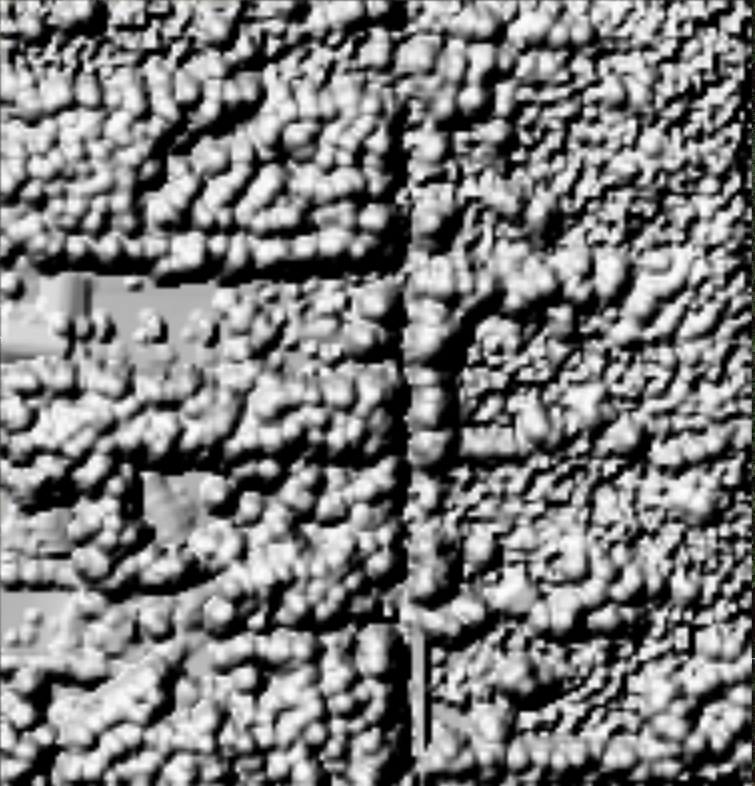
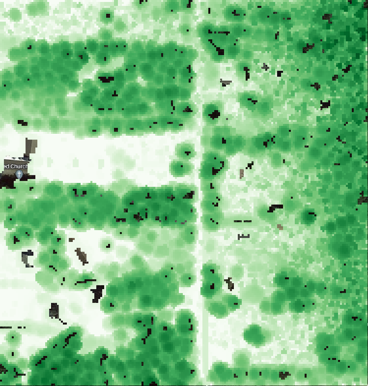

# Table of Contents
1. [Create a Raster](#grid)
2. [Raster Math](#raster_math)
3. [GDAL Visualization](#gdal_viz)
4. [Exercises](#exercises)


# Create a Raster <a name ="grid"></a>
- PDAL has a [writers.GDAL](https://pdal.io/en/2.5.3/stages/writers.gdal.html) writer than uses GDAL to create raster products in a variety of products and formats from input lidar point clouds.
- The "output_type" parameter allows users to specify the particular variable to grid:
   - Min
   - Max
   - Mean
   - IDW (Inverse Distance Weighted)
   - Count
   - Stdev (Standard Deviation)
   - All
   
- Example pipeline to create a Digital Surface Model (DSM) from our test dataset:

```
{
    "pipeline": [
        "./data/FoxIsland.laz",
	{
            "filename":"./data/FoxIsland_DSM.tif",
            "gdaldriver":"GTiff",
            "output_type":"max",
            "resolution":"2.0",
            "type": "writers.gdal"
	}
    ]
}
```

- The default is to grid the "Z" dimension of the data, but this can be changed with the "dimension" options.  For example to grid the Intensity values:

```
{
    "pipeline": [
        "./data/FoxIsland.laz",
	{
            "filename":"./data/FoxIsland_Intensity.tif",
            "gdaldriver":"GTiff",
            "dimension":"Intensity",
            "output_type":"max",
            "resolution":"2.0",
            "type": "writers.gdal"
	}
    ]
}
```

- [Geotiff options](https://gdal.org/drivers/raster/gtiff.html) can be passed to the GDAL writer in the form: name=value,name=value,…  For example, to create a tiled and compressed geotiff, which is a [basic Cloud Optimized Geotiff (COG) format](https://www.cogeo.org/in-depth.html), add this line to pipeline:

```
"gdalopts":"compress=deflate, tiled=yes"
```

- Cloud Optimized Geotiffs have two main components: internal tiling, and overviews.  Adding compression is also good practice, but technically an uncompressed file can still pass COG-validation. COGs were developed to aid in serving up imagery for webmaps, but have become more important with the advent of cloud computing.  Current versions of PDAL do not seem to have the GDAL drivers to output a COG format directly, but using the "gdalopts" comes pretty close.

- This pipeline created a 2m max geotiff. We use the "max" statistic because we are creating a DSM, so we want the highest valid point in each cell.  To get metadata on this grid, utilize the [gdalinfo](https://gdal.org/programs/gdalinfo.html) command:

```
 >> gdalinfo FoxIsland_DSM.tif|more
Driver: GTiff/GeoTIFF
Files: FoxIsland_DSM.tif
Size is 188, 197
Coordinate System is:
PROJCRS["WGS 84 / UTM zone 10N",
    BASEGEOGCRS["WGS 84",
        DATUM["World Geodetic System 1984",
            ELLIPSOID["WGS 84",6378137,298.257223563,
                LENGTHUNIT["metre",1]]],
        PRIMEM["Greenwich",0,
            ANGLEUNIT["degree",0.0174532925199433]],
        ID["EPSG",4326]],
    CONVERSION["UTM zone 10N",
        METHOD["Transverse Mercator",
            ID["EPSG",9807]],
        PARAMETER["Latitude of natural origin",0,
            ANGLEUNIT["degree",0.0174532925199433],
            ID["EPSG",8801]],
        PARAMETER["Longitude of natural origin",-123,
            ANGLEUNIT["degree",0.0174532925199433],
            ID["EPSG",8802]],
        PARAMETER["Scale factor at natural origin",0.9996,
            SCALEUNIT["unity",1],
            ID["EPSG",8805]],
        PARAMETER["False easting",500000,
            LENGTHUNIT["metre",1],
            ID["EPSG",8806]],
        PARAMETER["False northing",0,
            LENGTHUNIT["metre",1],
            ID["EPSG",8807]]],
    CS[Cartesian,2],
        AXIS["(E)",east,
            ORDER[1],
            LENGTHUNIT["metre",1]],
        AXIS["(N)",north,
            ORDER[2],
            LENGTHUNIT["metre",1]],
    USAGE[
        SCOPE["Navigation and medium accuracy spatial referencing."],
        AREA["Between 126<C2><B0>W and 120<C2><B0>W, northern hemisphere between equator and 84<C2><B0>N, onshore and offshore. Canada - British Columbia (BC); Northwest Territories (NWT); Nunavut; Yukon. United States (USA) - Alaska (AK)."],
        BBOX[0,-126,84,-120]],
    ID["EPSG",32610]]
Data axis to CRS axis mapping: 1,2
Origin = (527253.820000000065193,5233373.480000000447035)
Pixel Size = (2.000000000000000,-2.000000000000000)
Metadata:
  AREA_OR_POINT=Area
Image Structure Metadata:
  INTERLEAVE=BAND
Corner Coordinates:
Upper Left  (  527253.820, 5233373.480) (122d38'23.32"W, 47d15'11.80"N)
Lower Left  (  527253.820, 5232979.480) (122d38'23.41"W, 47d14'59.04"N)
Upper Right (  527629.820, 5233373.480) (122d38' 5.43"W, 47d15'11.74"N)
Lower Right (  527629.820, 5232979.480) (122d38' 5.52"W, 47d14'58.98"N)
Center      (  527441.820, 5233176.480) (122d38'14.42"W, 47d15' 5.39"N)
Band 1 Block=188x5 Type=Float64, ColorInterp=Gray
  Description = max
  NoData Value=-9999
```

- gdalinfo metadata will contain useful info about the coordinate system of the data, pixel, resolution, NoData values, and basic bounds of the dataset.

- If we load this raster into QGIS and apply a hillshade visualization, we get:


- Next we'll create a Digital Terrain Model (DTM), building on the pipeline we created earlier:

```
{
    "pipeline": [
        "./data/FoxIsland.laz",
        {
            "type": "filters.outlier",
            "method": "statistical",
            "multiplier": 3,
            "mean_k": 8
        },
        {
            "type": "filters.range",
            "limits": "Classification![135:146],Z[-10:3000]"
        },
	{
            "type": "filters.range",
            "limits": "Classification[2:2]"
        },
	{
            "filename":"./data/FoxIsland_DTM.tif",
            "gdaldriver":"GTiff",
            "output_type":"min",
            "resolution":"2.0",
            "type": "writers.gdal"
	}	
    ]
}
```

- This pipeline starts with the original, noisy file, cleans it, extracts just the ground, and then grids the ground classified data into a 2m Min geotiff.  We use the min statistic here because we are creating a DTM, so we want the lowest valid value per cell.

- Note with gdalinfo, we can also get more detailed statistics on a given file by using the **-stats** flag:

```
>> gdalinfo -stats FoxIsland_DTM.tif
Driver: GTiff/GeoTIFF
Files: FoxIsland_DTM.tif
Size is 187, 196
Coordinate System is:
PROJCRS["WGS 84 / UTM zone 10N",
    BASEGEOGCRS["WGS 84",
        DATUM["World Geodetic System 1984",
            ELLIPSOID["WGS 84",6378137,298.257223563,
                LENGTHUNIT["metre",1]]],
        PRIMEM["Greenwich",0,
            ANGLEUNIT["degree",0.0174532925199433]],
        ID["EPSG",4326]],
    CONVERSION["UTM zone 10N",
        METHOD["Transverse Mercator",
            ID["EPSG",9807]],
        PARAMETER["Latitude of natural origin",0,
            ANGLEUNIT["degree",0.0174532925199433],
            ID["EPSG",8801]],
        PARAMETER["Longitude of natural origin",-123,
            ANGLEUNIT["degree",0.0174532925199433],
            ID["EPSG",8802]],
        PARAMETER["Scale factor at natural origin",0.9996,
            SCALEUNIT["unity",1],
            ID["EPSG",8805]],
        PARAMETER["False easting",500000,
            LENGTHUNIT["metre",1],
            ID["EPSG",8806]],
        PARAMETER["False northing",0,
            LENGTHUNIT["metre",1],
            ID["EPSG",8807]]],
    CS[Cartesian,2],
        AXIS["(E)",east,
            ORDER[1],
            LENGTHUNIT["metre",1]],
        AXIS["(N)",north,
            ORDER[2],
            LENGTHUNIT["metre",1]],
    USAGE[
        SCOPE["Navigation and medium accuracy spatial referencing."],
        AREA["Between 126<C2><B0>W and 120<C2><B0>W, northern hemisphere between equator and 84<C2><B0>N, onshore and offshore. Canada - British Columbia (BC); Northwest Territories (NWT); Nunavut; Yukon. United States (USA) - Alaska (AK)."],
        BBOX[0,-126,84,-120]],
    ID["EPSG",32610]]
Data axis to CRS axis mapping: 1,2
Origin = (527255.300000000046566,5233373.100000000558794)
Pixel Size = (2.000000000000000,-2.000000000000000)
Metadata:
  AREA_OR_POINT=Area
Image Structure Metadata:
  INTERLEAVE=BAND
Corner Coordinates:
Upper Left  (  527255.300, 5233373.100) (122d38'23.25"W, 47d15'11.79"N)
Lower Left  (  527255.300, 5232981.100) (122d38'23.34"W, 47d14'59.09"N)
Upper Right (  527629.300, 5233373.100) (122d38' 5.46"W, 47d15'11.73"N)
Lower Right (  527629.300, 5232981.100) (122d38' 5.55"W, 47d14'59.03"N)
Center      (  527442.300, 5233177.100) (122d38'14.40"W, 47d15' 5.41"N)
Band 1 Block=187x5 Type=Float64, ColorInterp=Gray
  Description = min
  Minimum=41.140, Maximum=85.740, Mean=61.238, StdDev=8.987
  NoData Value=-9999
  Metadata:
    STATISTICS_MAXIMUM=85.74
    STATISTICS_MEAN=61.237679670299
    STATISTICS_MINIMUM=41.14
    STATISTICS_STDDEV=8.9866137579927
    STATISTICS_VALID_PERCENT=96.66
```

- Note that when calculating the min value with a smaller cell size for a ground-classified data, there may be gaps in the data.  

- If we load this raster into QGIS and apply a hillshade visualization, we get:


# Raster Math <a name ="raster_math"></a>
- use GDAL raster calculator to difference the DSM and DTM to create a CHM

```
>> gdal_calc.py -A ./data/FoxIsland_DSM.tif -B ./data/FoxIsland_DTM.tif --outfile ./data/CHM.tif --calc="A-B" --NoDataValue=-9999         
Traceback (most recent call last):
  File "/Users/beckley/miniconda3/envs/pdalworkshop/lib/python3.11/site-packages/osgeo_utils/auxiliary/gdal_argparse.py", line 175, in main
    self.doit(**kwargs)
  File "/Users/beckley/miniconda3/envs/pdalworkshop/lib/python3.11/site-packages/osgeo_utils/gdal_calc.py", line 879, in doit
    return Calc(**kwargs)
           ^^^^^^^^^^^^^^
  File "/Users/beckley/miniconda3/envs/pdalworkshop/lib/python3.11/site-packages/osgeo_utils/gdal_calc.py", line 261, in Calc
    raise Exception(
Exception: Error! Dimensions of file FoxIsland_DTM.tif (187, 196) are different from other files (188, 197).  Cannot proceed
```

- It appears the sizes of the two datasets are different:

```
>> gdalinfo ./data/FoxIsland_DSM.tif|grep -i Size
Size is 188, 197
Pixel Size = (2.000000000000000,-2.000000000000000)
(pdalworkshop) local:data >> gdalinfo FoxIsland_DTM.tif|grep -i Size
Size is 187, 196
Pixel Size = (2.000000000000000,-2.000000000000000)
```

- The cleaning and filtering of the ground classified dataset has removed some data and caused the bounds of the resulting DTM to be slightly smaller than the DSM, thus causing the error.  To get around this, there is an "extent" parameter in gdal_calc.py where users can specify the boundary extent to use in the calculation.

```
 gdal_calc.py -A ./data/FoxIsland_DSM.tif -B ./data/FoxIsland_DTM.tif --outfile ./data/CHM.tif --calc="A-B" --NoDataValue=-9999 --extent intersect
```

- In this case, we use the intersection of the two datasets, but there is also an option to use the union.  Using the intersect, we would expect that the output should be the same dimensions as the smaller grid (in this case the DTM), and it is:

```
gdalinfo ./data/CHM.tif|grep -i Size
Size is 187, 196
Pixel Size = (2.000000000000000,-2.000000000000000)
```

- If we load this raster into QGIS, we get a nice CHM highlighting the trees in this area:



# GDAL Visualization <a name ="gdal_viz"></a>
- The [gdaldem](https://gdal.org/programs/gdaldem.html) application is a quick and easy way to visualize raster products such as
   - Hillshade
   - Slope
   - Aspect
   - Roughness
   
```
gdaldem hillshade ./data/FoxIsland_DSM.tif ./data/FoxIsland_DSM_HS.tif -z 1 -az 315 -alt 45 
```

- Experiment with some of the different parameters.  For example, try out the "multidirectional" option

```
gdaldem hillshade ./data/FoxIsland_DSM.tif ./data/FoxIsland_DSM_HSMulti.tif -z 1 -multidirectional
```


# Exercises <a name ="exercises"></a>
- Try creating a grid of intensity values, and output as a [COG.](https://www.cogeo.org/) (see Part4_Exercise.json)
- Using either existing datasets or one of your own, create a Canopy Height Model
 


