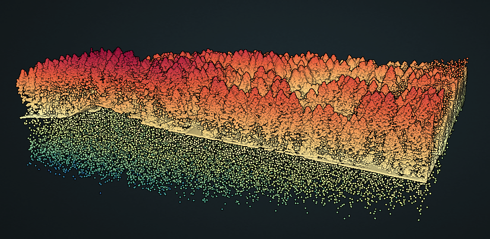
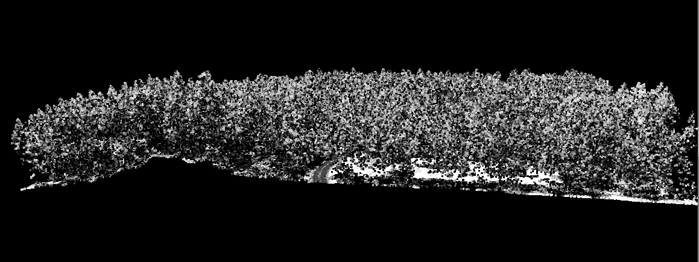
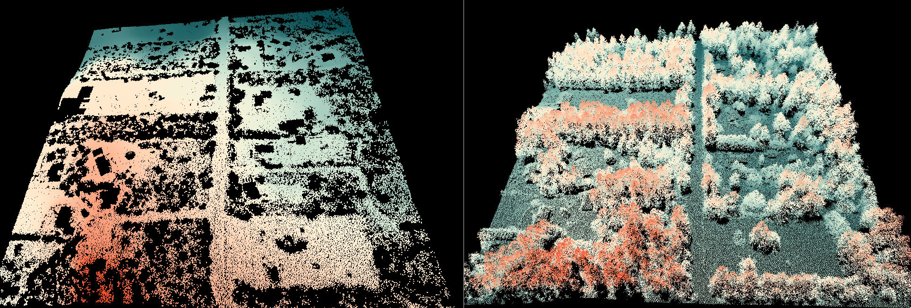
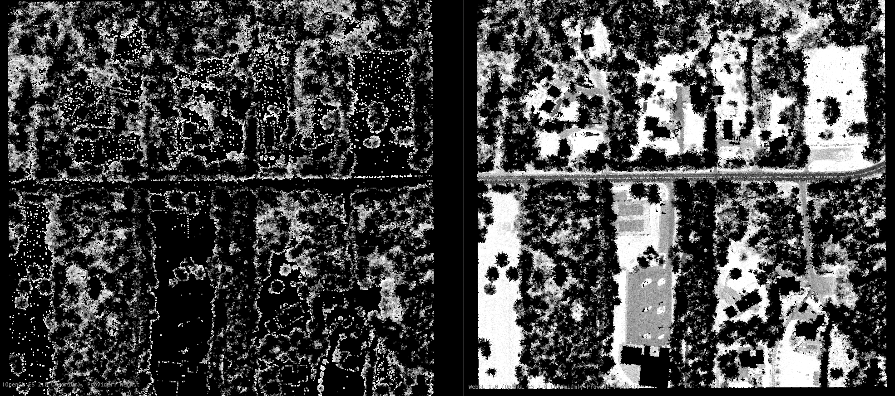
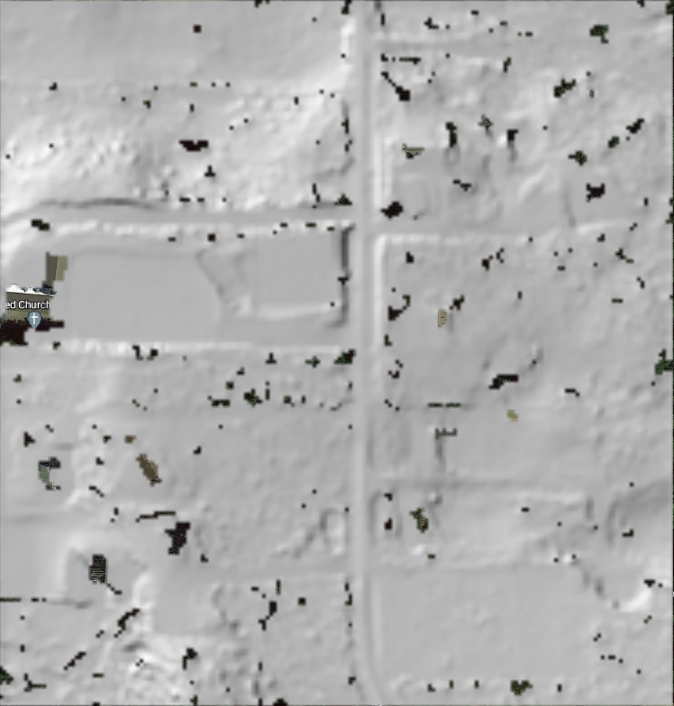

# Table of Contents
1. [Reprojection](#reprojection)
2. [Tiling](#tiling)
3. [Thinning](#thin) 
4. [Creating Boundaries](#boundary)


# Reprojection <a name ="reprojection"></a>
- Use the [reprojection filter](https://pdal.io/en/2.4.3/stages/filters.reprojection.html#filters-reprojection) to reproject datasets:

```
{
    "pipeline": [{"type" : "readers.las",
                  "filename": "input.las"
                 },
                 {"type":"filters.reprojection",
                  "in_srs":"EPSG:26910+5703",
                  "out_srs":"EPSG:6339+5703"
                 },
                 {"type" : "writers.las",
                  "filename": "output.laz",
                  "forward": "header",
                  "compression": "laszip",
                  "a_srs": "EPSG:6339+5703"
                 }
                 ]}
```

- This will reproject the data to a newer NAD83 realization (2011).  Putting the code for the NAVD88 datum in the EPSG code (e.g. 6339+5703) will display the vertical datum info in the metadata.

- older versions of PDAL would be able to apply a geoid by doing the following:

```
{
    "pipeline": [{"type" : "readers.las",
                  "filename": "input_Ellipsoidal.laz"
                 },
                 {"type":"filters.reprojection",
                  "in_srs":"EPSG:32611",
                  "out_srs":"+init=EPSG:32611 +geoidgrids=g2003conus.gtx"
                 },
                 {"type" : "writers.las",
                  "filename": "output_Geoid.laz",
                  "compression": "laszip",
                  "a_srs": "EPSG:32611+5703"
                 }
		]
}
```

- newer versions (>= 2.5) seem to have issues with the PROJ syntax and do not appear to read the geoid grids.

- PDAL leverages PROJ for working with coordinate systems.  This results in standardized coordinate system metadata, which is not always the case with other software. 

# Tiling data<a name ="tiling"></a>
- It is often useful to tile data when working with a single large datafile to prevent out-of-memory errors.  [Filters.splitter](https://pdal.io/en/2.5.3/stages/filters.splitter.html) is a useful filter that will split a given file into tiles of a given size.  


```
{
  "pipeline": [
	{
	    "type" : "readers.las",
            "filename": "./data/FoxIsland.laz"
        },
      {
	  "type": "filters.splitter",
	  "length": "500"
      },
      {
	  "type": "writers.las",
	  "filename": "./data/tile_#.laz"
    }
  ]
}

```

- This pipeline will split up the file into tiles of 500 m length.  It will increment the filenames until all the tiles are created (i.e. tile_1.laz, tile_2.laz, etc.)

# Thinning<a name ="thin"></a>
- Point cloud files can often be quite large and cumbersome to work with.  Depending on the objective, it is often useful to thin a dataset in order to make it easier and faster to work with. The [filters.sample](https://pdal.io/en/2.5.3/stages/filters.sample.html#filters-sample) utilizes a Poisson sampling to thin the dataset.

```
pdal translate ./data/FoxIsland_Clean.laz ./data/FoxIsland_Clean_Thin1m.laz sample --filters.sample.radius=1
```


- Left: Dataset after thinning with 1m radius.  Right: Original dataset before thinning

- Note there are a variety of other methods to decimate data via PDAL:
    - filters.decimation
    - filters.fps
    - filters.relaxationdartthrowing 
    - filters.voxelcenternearestneighbor 
    - filters.voxelcentroidnearestneighbor
    - filters.voxeldownsize
    

# Creating boundaries of data <a name ="reprojection"></a>
- Utilizing the info command, the boundary of a dataset can be obtained by using the "--boundary" flag.  This will output the boundary in WKT format in JSON-formatted output.

```
>> pdal info ./data/Siuslaw.laz --boundary 

{
  "boundary":
  {
    "area": 5083656.235,
    "avg_pt_per_sq_unit": 2.670004261,
    "avg_pt_spacing": 0.9299756138,
    "boundary": "POLYGON ((871585.08 436854.9,871635.22 436898.32,872562.93 436898.32,872613.07 436854.9,872863.8 436854.9,872913.95 436898.32,873465.56 436898.32,873465.56 438852.58,873390.34 438896.0,870920.64 438874.29,870908.1 436898.32,871509.86 436898.32,871585.08 436854.9))",
    "boundary_json": { "type": "Polygon", "coordinates": [ [ [ 871585.07628024998121, 436854.896951399976388 ], [ 871635.222414609976113, 436898.324777669971809 ], [ 872562.925900229951367, 436898.324777669971809 ], [ 872613.07203458994627, 436854.896951399976388 ], [ 872863.802706380025484, 436854.896951399976388 ], [ 872913.948840740020387, 436898.324777669971809 ], [ 873465.556318680057302, 436898.324777669971809 ], [ 873465.556318680057302, 438852.57695966999745 ], [ 873390.33711714996025, 438896.004785929981153 ], [ 870920.64000000001397, 438874.290872799989302 ], [ 870908.103466409957036, 436898.324777669971809 ], [ 871509.857078709988855, 436898.324777669971809 ], [ 871585.07628024998121, 436854.896951399976388 ] ] ] },
    "density": 1.156263667,
    "edge_length": 0,
    "estimated_edge": 43.42782627,
    "hex_offsets": "MULTIPOINT (0 0, -12.5365 21.7139, 0 43.4278, 25.0731 43.4278, 37.6096 21.7139, 25.0731 0)",
    "sample_size": 5000,
    "threshold": 15
  },
  "file_size": 27167488,
  "filename": "./data/OR_WizardIsland.laz",
  "now": "2023-04-25T17:03:10-0600",
  "pdal_version": "2.5.3 (git-version: Release)",
  "reader": "readers.las"
}

```

- However, to get a boundary in vector format to visualize in a GIS or Google Earth requires some additional steps.  The PDAL command, [tindex](https://pdal.io/en/2.5.3/apps/tindex.html#tindex-command) is used to create a boundary that utilizes the [hexbin filter](https://pdal.io/en/2.5.3/stages/filters.hexbin.html#filters-hexbin)

```
>> pdal tindex create --tindex ./data/Siuslaw_bounds.shp --filespec ./data/Siuslaw.laz -f "ESRI Shapefile"
```

- Load the shapefile into a GIS to see its extent:


- For rough estimations of boundaries, this is usually sufficient. To obtain a more precise fit of the data alter some of the parameters in the [filters.hexbin](https://pdal.io/en/2.5.3/stages/filters.hexbin.html#filters-hexbin) command.  The "edge_size" parameter is particularly useful for this scenario as it controls the size of the hexagon boundaries used to estimate whether a section of the dataset should be considered. Finding an appropriate value for edge_size can be an iterative process.  For example, try using a vlue of "50" units (for this dataset, the units are feet).

```
>> pdal tindex create --tindex ./data/Siuslaw_bounds50.shp --filters.hexbin.edge_size=50 --filespec ./data/Siuslaw.laz -f "ESRI Shapefile"

```

- Load the shapefile into a GIS to see its extent:


- Note how this is a much better fit to the data, and shows regions where there is no data (over the water). However, use caution with the edge_size parameter as setting it too low might not capture an appropriate amount of data, and mis-represent the data coverage.

# Filtering
- PDAL offers lots of different [filtering operations](https://pdal.io/en/2.5.3/stages/filters.html).

- Removing noise is a basic operation that is often used when working with lidar data.  Standard ASPRS classifications assign low point noise a value of 7, and high point noise a value of 18.  However, sometimes providers don't follow these conventions and may classify noise as a custom value.  For example, the USGS 3DEP data over Tacoma: [WA PierceCounty 1 2020](https://portal.opentopography.org/usgsDataset?dsid=WA_PierceCounty_1_2020) has noisy data with classifications of 135 and 146.  It is often useful to use the Potree 3D point cloud viewer in OpenTopography to visualize the point cloud.



- From this visualization, we can see an excessive amount of noise both below and above the ground surface

- We can first do a summary of the classifications, to see what we need to remove:

```
>> pdal info ./data/FoxIsland.laz --stats --filters.stats.dimensions=Classification  --filters.stats.count=Classification
{
  "file_size": 18337307,
  "filename": "FoxIsland.laz",
  "now": "2023-04-26T13:48:53-0600",
  "pdal_version": "2.5.3 (git-version: Release)",
  "reader": "readers.las",
  "stats":
  {
    "statistic":
    [
      {
        "average": 5.633072822,
        "count": 3100062,
        "counts":
        [
          "1.000000/2524244",
          "2.000000/474803",
          "135.000000/69015",
          "146.000000/32000"
        ],
        "maximum": 146,
        "minimum": 1,
        "name": "Classification",
        "position": 0,
        "stddev": 24.4020614,
        "variance": 595.4606004
      }
    ]
  }
}

```

- From this summary, we can see that we probably want to get rid of class 135 and 146. Create a new pipeline that will have stages to remove outliers, as well as remove points by classification and range.  For example:

```
{
    "pipeline": [
        "./data/FoxIsland.laz",
        {
            "type": "filters.outlier",
            "method": "statistical",
            "multiplier": 3,
            "mean_k": 8
        },
        {
            "type": "filters.range",
            "limits": "Classification![135:146],Z[-10:3000]"
        },
        {
            "type": "writers.las",
            "compression": "true",
            "filename":"./data/FoxIsland_Clean.laz"
        }
    ]
}
```

- The first stage of this pipeline is removing any statistical outliers by using the [filters.outlier](https://pdal.io/en/2.5.3/stages/filters.outlier.html). For this example, we are using the statistical filtering method to compute a mean distance from each point to its nearest neighbors and compare that with a global threshold value (calculated from the mean of all distances).  There are a variety of options to adjust the calculations of the threshold and other parameters.

- The second stage of the pipeline performs a range filter.  First it includes only classes that are **NOT (note the "!")** in the range of 135 - 146.  Then it include only elevation values in the range of -10 to 3000.  

- Run the pipeline and check the classifications:

```
>> pdal info FoxIsland_Clean.laz --stats --filters.stats.dimensions=Classification  --filters.stats.count=Classification
{
  "file_size": 18100550,
  "filename": "FoxIsland_Clean.laz",
  "now": "2023-04-26T14:07:52-0600",
  "pdal_version": "2.5.3 (git-version: Release)",
  "reader": "readers.las",
  "stats":
  {
    "statistic":
    [
      {
        "average": 1.303642411,
        "count": 3073184,
        "counts":
        [
          "1.000000/2522040",
          "2.000000/474743",
          "7.000000/76401"
        ],
        "maximum": 7,
        "minimum": 1,
        "name": "Classification",
        "position": 0,
        "stddev": 0.9783966857,
        "variance": 0.9572600745
      }
    ]
  }
}
```

- Now we have a low point class (class 7), that we didn't have in the original dataset.  This is because the outlier stage writes out values as noise that are not within its statistical threshold.  So, we need to modify our pipeline to now also remove low point noise:

```
{
    "pipeline": [
        "./data/FoxIsland.laz",
        {
            "type": "filters.outlier",
            "method": "statistical",
            "multiplier": 3,
            "mean_k": 8
        },
        {
            "type": "filters.range",
            "limits": "Classification![135:146],Z[-10:3000]"
        },
	{
            "type": "filters.range",
            "limits": "Classification![7:7]"
        },	
        {
            "type": "writers.las",
            "compression": "true",
            "filename":"./data/FoxIsland_Clean.laz"
        }
    ]
}
```

- Removing the low point classification had to be added as a separate stage.  Initial attempts at doing the filtering in one stage (e.g. "limits": "Classification![135:146],Classification![7:7],Z[-10:3000]") were unsuccessful.  This may be a result of streaming mode and doing operations in memory. Adding the low point noise removal as a separate stage works fine, and now the details on the classifications show that only "ground" and "unassigned" are in the new data file: 

```
pdal info FoxIsland_Clean.laz --stats --filters.stats.dimensions=Classification  --filters.stats.count=Classification
{
  "file_size": 17452659,
  "filename": "FoxIsland_Clean.laz",
  "now": "2023-04-26T14:24:31-0600",
  "pdal_version": "2.5.3 (git-version: Release)",
  "reader": "readers.las",
  "stats":
  {
    "statistic":
    [
      {
        "average": 1.158417543,
        "count": 2996783,
        "counts":
        [
          "1.000000/2522040",
          "2.000000/474743"
        ],
        "maximum": 2,
        "minimum": 1,
        "name": "Classification",
        "position": 0,
        "stddev": 0.3651321262,
        "variance": 0.1333214696
      }
    ]
  }
}

```

- [plas.io](https://plas.io/) is a useful site to quickly look at a local las/laz file.  Loading the "clean" file that was just created, we can see that the noise has been removed:




    

# Ground Classifications 
- compare using existing ground classifications vs calculating from scratch (i.e. assume a scenario where the data was provided without classifications)

- Extract only the ground classified points with the following pipeline:

```
{
    "pipeline": [
        "./data/FoxIsland_Clean.laz",
        {
            "type": "filters.range",
            "limits": "Classification[2:2]"
        },
        {
            "type": "writers.las",
            "compression": "true",
            "filename":"./data/FoxIsland_Clean_GroundOnly.laz"
        }
    ]
}

>> pdal pipeline ./pipelines/ExtractGround.json
```

- Inspect the ground-only point cloud with [plas.io](https://plas.io/)

- Image on the left is the ground only point cloud vs the original dataset on the right

- In some cases we may receive a dataset that has very poor ground classification, or none at all.  In these scenarios it is probably best to re-calculate the ground surface.  Here is more complicated pipeline that demonstrates how to create a ground classification from scratch:

```
{
    "pipeline": [
        "./data/FoxIsland.laz",
	{
	    "type":"filters.assign",
	    "assignment":"Classification[:]=0"
	},
	{
	    "type":"filters.elm"
	},
        {
            "type": "filters.outlier",
            "method": "statistical",
            "multiplier": 3,
            "mean_k": 8
        },	
	{
	    "type":"filters.smrf",
	    "returns":"last,only",
	    "ignore":"Classification[7:7]"
	},
	{
	    "type":"filters.range",
	    "limits":"Classification[2:2]"
	},	
        {
            "type": "writers.las",
            "compression": "true",
            "filename":"./data/FoxIsland_CustomGround.laz"
        }
    ]
}

```

- In this pipeline we are starting with a lidar dataset that has all returns included (i.e. trees, buildings, etc), as well as containing a lot of noise.  The first stage of the pipeline sets all classification values to 0 (unclassified) to mimic the scenario of receiving a dataset without any classification values.  
- The second stage uses the [Extended Local Minimum (ELM) method](https://pdal.io/en/2.5.3/stages/filters.elm.html#filters-elm) to identify low noise points, and classify them as noise (class 7). 
- The third stage is using the [filters.outlier] filter to remove statistical outliers.  Outliers are set class 7.
- The fourth stage is using the [Simple Morphological Filter (SMRF)](https://pdal.io/en/2.5.3/stages/filters.smrf.html) to classify points as ground.  There are a couple of important options to set here.  Note instead of using a noise-free input dataset, we instead set the "ignore" option to ignore all values classified as noise.  For this pipeline, the filters.elm, and filters.outlier stages will have output noise values, so we don't want to include those. The other important option is the "returns" option.  When calculating a ground surface it might make sense to only use "last" returns.  However, this can lead to excessive filtering of data because of cases where there is only 1 return (e.g. return from a road).  As a result, it is best to set this parameter to: "returns":"last,only" which will take last returns where available, but also include points that are single returns.  This is the default setting for this parameter in PDAL. A comparison of outputs using "last" vs "last, only" is below.
- Finally, the last stage does a range filter, and only outputs points classified as ground (class 2).

- Here is a comparison of the ground only dataset using the vendor supplied classes (image on right) vs the "custom" ground classified dataset (image on left) we created from scratch using the SMRF filter:


- Based purely on visual inspection, the SMRF filter does a decent job of creating a ground classified dataset.

- Here is a comparison of using the SMRF filter with only the "last" returns (image on left) vs using both the "last" and "only" returns (image on right).  Using only "last" returns can often filter out too much data:



# Create a Raster
- PDAL has a [writers.GDAL](https://pdal.io/en/2.5.3/stages/writers.gdal.html) writer than uses GDAL to create raster products in a variety of products and formats from input lidar point clouds.
- The "output_type" parameter allows users to specify the particular variable to grid:
   - Min
   - Max
   - Mean
   - IDW (Inverse Distance Weighted)
   - Count
   - Stdev (Standard Deviation)
   - All
   
- Example pipeline to create a Digital Surface Model (DSM) from our test dataset:

```
{
    "pipeline": [
        "./data/FoxIsland.laz",
	{
            "filename":"./data/FoxIsland_DSM.tif",
            "gdaldriver":"GTiff",
            "output_type":"max",
            "resolution":"2.0",
            "type": "writers.gdal"
	}
    ]
}
```

- This pipeline will create a 2m max geotiff. We use the "max" statistic because we are creating a DSM, so we want the highest valid point in each cell.  To get metadata on this grid, utilize the [gdalinfo](https://gdal.org/programs/gdalinfo.html) command:

```
 >> gdalinfo FoxIsland_DSM.tif|more
Driver: GTiff/GeoTIFF
Files: FoxIsland_DSM.tif
Size is 188, 197
Coordinate System is:
PROJCRS["WGS 84 / UTM zone 10N",
    BASEGEOGCRS["WGS 84",
        DATUM["World Geodetic System 1984",
            ELLIPSOID["WGS 84",6378137,298.257223563,
                LENGTHUNIT["metre",1]]],
        PRIMEM["Greenwich",0,
            ANGLEUNIT["degree",0.0174532925199433]],
        ID["EPSG",4326]],
    CONVERSION["UTM zone 10N",
        METHOD["Transverse Mercator",
            ID["EPSG",9807]],
        PARAMETER["Latitude of natural origin",0,
            ANGLEUNIT["degree",0.0174532925199433],
            ID["EPSG",8801]],
        PARAMETER["Longitude of natural origin",-123,
            ANGLEUNIT["degree",0.0174532925199433],
            ID["EPSG",8802]],
        PARAMETER["Scale factor at natural origin",0.9996,
            SCALEUNIT["unity",1],
            ID["EPSG",8805]],
        PARAMETER["False easting",500000,
            LENGTHUNIT["metre",1],
            ID["EPSG",8806]],
        PARAMETER["False northing",0,
            LENGTHUNIT["metre",1],
            ID["EPSG",8807]]],
    CS[Cartesian,2],
        AXIS["(E)",east,
            ORDER[1],
            LENGTHUNIT["metre",1]],
        AXIS["(N)",north,
            ORDER[2],
            LENGTHUNIT["metre",1]],
    USAGE[
        SCOPE["Navigation and medium accuracy spatial referencing."],
        AREA["Between 126<C2><B0>W and 120<C2><B0>W, northern hemisphere between equator and 84<C2><B0>N, onshore and offshore. Canada - British Columbia (BC); Northwest Territories (NWT); Nunavut; Yukon. United States (USA) - Alaska (AK)."],
        BBOX[0,-126,84,-120]],
    ID["EPSG",32610]]
Data axis to CRS axis mapping: 1,2
Origin = (527253.820000000065193,5233373.480000000447035)
Pixel Size = (2.000000000000000,-2.000000000000000)
Metadata:
  AREA_OR_POINT=Area
Image Structure Metadata:
  INTERLEAVE=BAND
Corner Coordinates:
Upper Left  (  527253.820, 5233373.480) (122d38'23.32"W, 47d15'11.80"N)
Lower Left  (  527253.820, 5232979.480) (122d38'23.41"W, 47d14'59.04"N)
Upper Right (  527629.820, 5233373.480) (122d38' 5.43"W, 47d15'11.74"N)
Lower Right (  527629.820, 5232979.480) (122d38' 5.52"W, 47d14'58.98"N)
Center      (  527441.820, 5233176.480) (122d38'14.42"W, 47d15' 5.39"N)
Band 1 Block=188x5 Type=Float64, ColorInterp=Gray
  Description = max
  NoData Value=-9999
```

- gdalinfo metadata will contain useful info about the coordinate system of the data, pixel, resolution, NoData values, and basic bounds of the dataset.

- If we load this raster into QGIS and apply a hillshade visualization, we get:


- Next we'll create a Digital Terrain Model (DTM), building on the pipeline we created earlier:

```
{
    "pipeline": [
        "./data/FoxIsland.laz",
        {
            "type": "filters.outlier",
            "method": "statistical",
            "multiplier": 3,
            "mean_k": 8
        },
        {
            "type": "filters.range",
            "limits": "Classification![135:146],Z[-10:3000]"
        },
	{
            "type": "filters.range",
            "limits": "Classification[2:2]"
        },
	{
            "filename":"./data/FoxIsland_DTM.tif",
            "gdaldriver":"GTiff",
            "output_type":"min",
            "resolution":"2.0",
            "type": "writers.gdal"
	}	
    ]
}
```

- This pipeline starts with the original, noisy file, cleans it, extracts just the ground, and then grids the ground classified data into a 2m Min geotiff.  We use the min statistic here because we are creating a DTM, so we want the lowest valid value per cell.

- Note with gdalinfo, we can also get more detailed statistics on a given file by using the **-stats** flag:

```
>> gdalinfo -stats FoxIsland_DTM.tif
Driver: GTiff/GeoTIFF
Files: FoxIsland_DTM.tif
Size is 187, 196
Coordinate System is:
PROJCRS["WGS 84 / UTM zone 10N",
    BASEGEOGCRS["WGS 84",
        DATUM["World Geodetic System 1984",
            ELLIPSOID["WGS 84",6378137,298.257223563,
                LENGTHUNIT["metre",1]]],
        PRIMEM["Greenwich",0,
            ANGLEUNIT["degree",0.0174532925199433]],
        ID["EPSG",4326]],
    CONVERSION["UTM zone 10N",
        METHOD["Transverse Mercator",
            ID["EPSG",9807]],
        PARAMETER["Latitude of natural origin",0,
            ANGLEUNIT["degree",0.0174532925199433],
            ID["EPSG",8801]],
        PARAMETER["Longitude of natural origin",-123,
            ANGLEUNIT["degree",0.0174532925199433],
            ID["EPSG",8802]],
        PARAMETER["Scale factor at natural origin",0.9996,
            SCALEUNIT["unity",1],
            ID["EPSG",8805]],
        PARAMETER["False easting",500000,
            LENGTHUNIT["metre",1],
            ID["EPSG",8806]],
        PARAMETER["False northing",0,
            LENGTHUNIT["metre",1],
            ID["EPSG",8807]]],
    CS[Cartesian,2],
        AXIS["(E)",east,
            ORDER[1],
            LENGTHUNIT["metre",1]],
        AXIS["(N)",north,
            ORDER[2],
            LENGTHUNIT["metre",1]],
    USAGE[
        SCOPE["Navigation and medium accuracy spatial referencing."],
        AREA["Between 126<C2><B0>W and 120<C2><B0>W, northern hemisphere between equator and 84<C2><B0>N, onshore and offshore. Canada - British Columbia (BC); Northwest Territories (NWT); Nunavut; Yukon. United States (USA) - Alaska (AK)."],
        BBOX[0,-126,84,-120]],
    ID["EPSG",32610]]
Data axis to CRS axis mapping: 1,2
Origin = (527255.300000000046566,5233373.100000000558794)
Pixel Size = (2.000000000000000,-2.000000000000000)
Metadata:
  AREA_OR_POINT=Area
Image Structure Metadata:
  INTERLEAVE=BAND
Corner Coordinates:
Upper Left  (  527255.300, 5233373.100) (122d38'23.25"W, 47d15'11.79"N)
Lower Left  (  527255.300, 5232981.100) (122d38'23.34"W, 47d14'59.09"N)
Upper Right (  527629.300, 5233373.100) (122d38' 5.46"W, 47d15'11.73"N)
Lower Right (  527629.300, 5232981.100) (122d38' 5.55"W, 47d14'59.03"N)
Center      (  527442.300, 5233177.100) (122d38'14.40"W, 47d15' 5.41"N)
Band 1 Block=187x5 Type=Float64, ColorInterp=Gray
  Description = min
  Minimum=41.140, Maximum=85.740, Mean=61.238, StdDev=8.987
  NoData Value=-9999
  Metadata:
    STATISTICS_MAXIMUM=85.74
    STATISTICS_MEAN=61.237679670299
    STATISTICS_MINIMUM=41.14
    STATISTICS_STDDEV=8.9866137579927
    STATISTICS_VALID_PERCENT=96.66
```

- Note that when calculating the min value with a smaller cell size for a ground-classified data, there may be gaps in the data.  

- If we load this raster into QGIS and apply a hillshade visualization, we get:


# Create a Canopy Height Model (CHM) with GDAL
- use GDAL raster calculator to difference the DSM and DTM to create a CHM

```
>> gdal_calc.py -A FoxIsland_DSM.tif -B FoxIsland_DTM.tif --outfile CHM.tif --calc="A-B" --NoDataValue=-9999         
Traceback (most recent call last):
  File "/Users/beckley/miniconda3/envs/pdalworkshop/lib/python3.11/site-packages/osgeo_utils/auxiliary/gdal_argparse.py", line 175, in main
    self.doit(**kwargs)
  File "/Users/beckley/miniconda3/envs/pdalworkshop/lib/python3.11/site-packages/osgeo_utils/gdal_calc.py", line 879, in doit
    return Calc(**kwargs)
           ^^^^^^^^^^^^^^
  File "/Users/beckley/miniconda3/envs/pdalworkshop/lib/python3.11/site-packages/osgeo_utils/gdal_calc.py", line 261, in Calc
    raise Exception(
Exception: Error! Dimensions of file FoxIsland_DTM.tif (187, 196) are different from other files (188, 197).  Cannot proceed
```

- It appears the sizes of the two datasets are different:

```
>> gdalinfo FoxIsland_DSM.tif|grep -i Size
Size is 188, 197
Pixel Size = (2.000000000000000,-2.000000000000000)
(pdalworkshop) local:data >> gdalinfo FoxIsland_DTM.tif|grep -i Size
Size is 187, 196
Pixel Size = (2.000000000000000,-2.000000000000000)
```

- The cleaning and filtering of the ground classified dataset has removed some data and caused the bounds of the resulting DTM to be slightly smaller than the DSM, thus causing the error.  To get around this, there is an "extent" parameter in gdal_calc.py where users can specify the boundary extent to use in the calculation.

```
 gdal_calc.py -A FoxIsland_DSM.tif -B FoxIsland_DTM.tif --outfile CHM.tif --calc="A-B" --NoDataValue=-9999 --extent intersect
```

- In this case, we use the intersection of the two datasets, but there is also an option to use the union.  Using the intersect, we would expect that the output should be the same dimensions as the smaller grid (in this case the DTM), and it is:

```
gdalinfo CHM.tif|grep -i Size
Size is 187, 196
Pixel Size = (2.000000000000000,-2.000000000000000)
```

- If we load this raster into QGIS, we get a nice CHM highlighting the trees in this area:


# Exercises
- Using either existing datasets or one of your own, create a Canopy Height Model
- 
 


